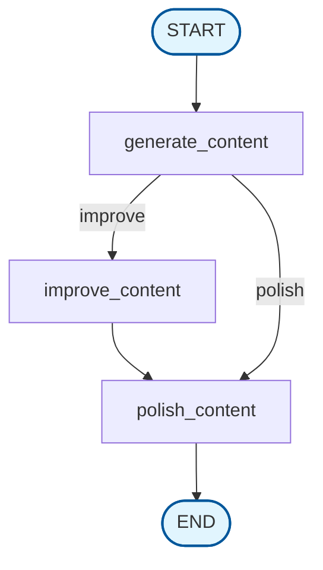

# ai

Simple to use AI library for Rust with OpenAI compatible providers and graph-based workflow execution.

*This library is work in progress, and the API is subject to change.*

## Table of Contents
- [Using the Library](#using-the-library)
- [Cargo Features](#cargo-features)
- [Examples](#examples)
  - [Chat Completion API](#chat-completion-api)
  - [Embeddings API](#embeddings-api)
  - [Graph](#graph)
- [Clients](#clients)
  - [OpenAI](#openai)
    - [Gemini API via OpenAI](#gemini-api-via-openai)
  - [Azure OpenAI](#azure-openai)
  - [Ollama](#ollama)
- [License](#license)

# Using the library

Add [ai](https://crates.io/crates/ai) as a dependency along with `tokio`. For
streaming add `futures` crate, for `CancellationToken` support add `tokio-util`.
This library directly uses `reqwest` for http client when making requests to the
servers.

```
cargo add ai
```

# Cargo Features

| Feature               | Description                               | Default |
|-----------------------|-------------------------------------------|---------|
| `openai_client`       | Enable OpenAI client                      | ✅      |
| `azure_openai_client` | Enable Azure OpenAI client                | ✅      |
| `ollama_client`       | Enable Ollama client                      |         |
| `native_tls`          | Enable native TLS for reqwest http client |         |
| `rustls_tls`          | Enable rustls TLS for reqwest http client | ✅      |

# Examples

| Example Name                      | Description                                                               |
|-----------------------------------|---------------------------------------------------------------------------|
| azure_openai_chat_completions                         | Basic chat completions using Azure OpenAI API         |
| chat_completions_streaming                            | Chat completions streaming example                    |
| chat_completions_streaming_with_cancellation_token    | Chat completions streaming with cancellation token    |
| chat_completions_tool_calling                         | Tool/Function calling example                         |
| chat_console                                          | Console chat example                                  |
| clients_dynamic_runtime                               | Dynamic runtime client selection                      |
| graph_example                                         | Graph workflow execution with conditional logic       |
| openai_chat_completions                               | Basic chat completions using OpenAI API               |
| openai_embeddings                                     | Text embeddings with OpenAI API                       |

## Chat Completion API

```rust
use ai::{
    chat_completions::{ChatCompletion, ChatCompletionMessage, ChatCompletionRequestBuilder},
    Result,
};

#[tokio::main]
async fn main() -> Result<()> {
    let openai = ai::clients::openai::Client::from_url("ollama", "http://localhost:11434/v1")?;
    // let openai = ai::clients::openai::Client::from_env()?;
    // let openai = ai::clients::openai::Client::new("api_key")?;

    let request = ChatCompletionRequestBuilder::default()
        .model("gemma3")
        .messages(vec![
            ChatCompletionMessage::System("You are a helpful assistant".into()),
            ChatCompletionMessage::User("Tell me a joke.".into()),
        ])
        .build()?;

    let response = openai.chat_completions(&request).await?;

    println!("{}", &response.choices[0].message.content.as_ref().unwrap());

    Ok(())
}
```

## Embeddings API

```rust
use ai::{
    embeddings::{Embeddings, EmbeddingsRequestBuilder},
    Result,
};

#[tokio::main]
async fn main() -> Result<()> {
    let openai = ai::clients::openai::Client::from_env()?;

    let request = EmbeddingsRequestBuilder::default()
        .model("text-embedding-3-small")
        .input(vec!["Hello, world!".to_string()])
        .build()?;

    // Get standard float embeddings
    let response = openai.create_embeddings(&request).await?;

    println!("Embedding dimensions: {}", response.data[0].embedding.len());

    // Get base64 encoded embeddings
    let base64_response = openai.create_base64_embeddings(&request).await?;

    println!("Base64 embedding: {}", base64_response.data[0].embedding);

    Ok(())
}
```

Using tuples for messages. Unrecognized `role` will cause panic.

```rust
let request = &ChatCompletionRequestBuilder::default()
    .model("gpt-4o-mini".to_string())
    .messages(vec![
        ("system", "You are a helpful assistant.").into(),
        ("user", "Tell me a joke").into(),
    ])
    .build()?;
```

## Graph

Build and execute complex workflows with conditional logic and async node execution.

```rust
use ai::graph::{Graph, START, END};
use std::collections::HashMap;

#[derive(Clone, Debug)]
struct State {
    message: String,
    count: i32,
    quality_score: i32,
}

#[tokio::main]
async fn main() -> Result<(), Box<dyn std::error::Error + Send + Sync>> {
    let graph = Graph::new()
        .add_node("generate_content", |mut state: State| async move {
            state.message = format!("Generated content: {}", state.message);
            state.quality_score = 6;
            println!("Generate: {}", state.message);
            Ok(state)
        })
        .add_node("improve_content", |mut state: State| async move {
            state.message = format!("Improved: {}", state.message);
            state.quality_score += 3;
            state.count += 1;
            println!("Improve: {} (quality: {})", state.message, state.quality_score);
            Ok(state)
        })
        .add_node("polish_content", |mut state: State| async move {
            state.message = format!("Polished: {}", state.message);
            state.quality_score = 10;
            println!("Polish: {} (final quality: {})", state.message, state.quality_score);
            Ok(state)
        })
        .add_edge(START, "generate_content")
        .add_conditional_edges(
            "generate_content",
            |state: State| async move {
                if state.quality_score < 8 {
                    "improve".to_string()
                } else {
                    "polish".to_string()
                }
            },
            {
                let mut mapping = HashMap::new();
                mapping.insert("improve", "improve_content");
                mapping.insert("polish", "polish_content");
                mapping
            },
        )
        .add_edge("improve_content", "polish_content")
        .add_edge("polish_content", END);

    let compiled_graph = graph.compile()?;
    
    let initial_state = State {
        message: "Hello World".to_string(),
        count: 0,
        quality_score: 0,
    };

    let result = compiled_graph.execute(initial_state).await?;
    println!("Final result: {:?}", result);

    Ok(())
}
```

The graph can be visualized using Mermaid syntax. Use `draw_mermaid()` to generate the diagram:



Visit [mermaid.live](https://mermaid.live) to see a live preview of your graph diagrams.

# Clients

## OpenAI

```sh
cargo add ai --features=openai_client
```

```rust
let openai = ai::clients::openai::Client::new("open_api_key")?;
let openai = ai::clients::openai::Client::from_url("open_api_key", "http://api.openai.com/v1")?;
let openai = ai::clients::openai::Client::from_env()?;
```

### Gemini API via OpenAI

Set `http1_title_case_headers` for Gemini API.

```rust
let gemini = ai::clients::openai::ClientBuilder::default()
    .http_client(
        reqwest::Client::builder()
            .http1_title_case_headers()
            .build()?,
    )
    .api_key("gemini_api_key".into())
    .base_url("https://generativelanguage.googleapis.com/v1beta/openai".into())
    .build()?;
```

## Azure OpenAI

```
cargo add ai --features=azure_openai_client
```

```rust
let azure_openai = ai::clients::azure_openai::ClientBuilder::default()
    .auth(ai::clients::azure_openai::Auth::BearerToken("token".into()))
    // .auth(ai::clients::azure_openai::Auth::ApiKey(
    //     std::env::var(ai::clients::azure_openai::AZURE_OPENAI_API_KEY_ENV_VAR)
    //         .map_err(|e| Error::EnvVarError(ai::clients::azure_openai::AZURE_OPENAI_API_KEY_ENV_VAR.to_string(), e))?
    //         .into(),
    // ))
    .api_version("2024-02-15-preview")
    .base_url("https://resourcename.openai.azure.com")
    .build()?;
```

Pass the `deployment_id` as `model` of the `ChatCompletionRequest`.

Use the following command to get bearer token.

```sh
az account get-access-token --resource https://cognitiveservices.azure.com
```

## Ollama

Suggest using openai client instead of ollama for maximum compatibility.

```sh
cargo add ai --features=ollama_client
```

```rust
let ollama = ai::clients::ollama::Client::new()?;
let ollama = ai::clients::ollama::Client::from_url("http://localhost:11434")?;
```

# LICENSE

MIT
